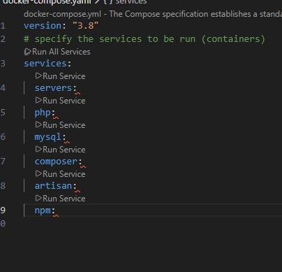
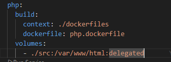
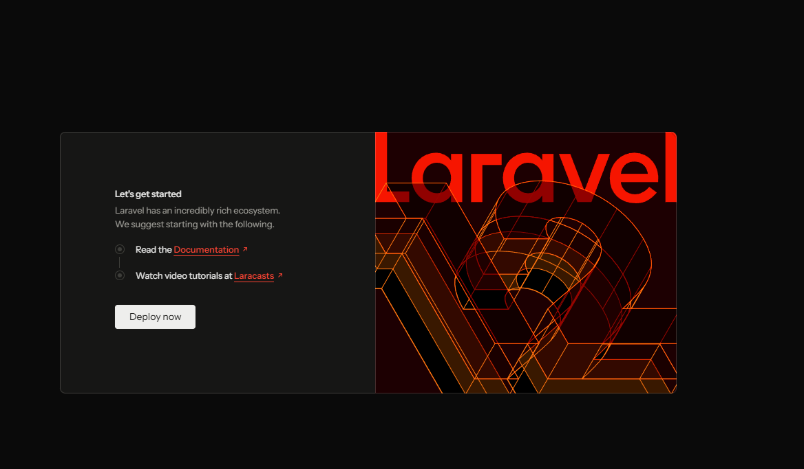
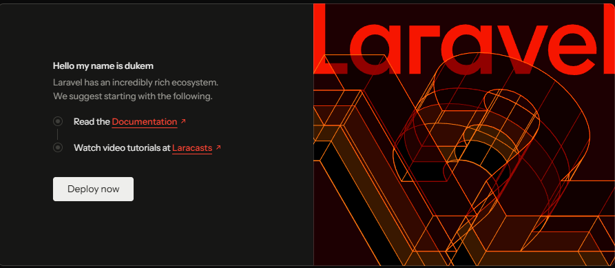

## intro
* today I will try to dockerize a laravel and php project, 
* I will try to run the app only using docker containers
* I do not have any laravel or php installed on my machine and also I do not have any experience with php and laravel
* The reason is I want to emphasize docker can be use to run any app regardless of the tech stack
* I will document the steps I take to dockerize the app in this file

* for more , Laravel and PHP that requires

quite a complex setup on your machine. with some tech like node js, you can just install node and npm and run the app. but with laravel and php, you need to install php, composer, a web server like apache or nginx, and a database like mysql or postgresql. so dockerizing the app will make it easier to run without worrying about installing all these dependencies on my machine.

## what so special about laravel and php
* if we explore laravel doc, there iare quite alot of requirements to run a laravel app
* we need php, and php is still not enough
* bback to compare to node js, it is not only the language in which we write the code, but also the runtime that runs the code, build the server that handles the request, and also the package manager that manages the dependencies. so we have applcaituon code and the server logic all in one place.
* with php and laravel, we cant build the server with php alone, Instead, we need a server that handles incoming requests

which then triggers the PHP interpreter

to run our PHP code for these incoming requests.

And setting all of that up on your local machine

possibly combined with MySQL or

MongoDB databases, that can be quite annoying.

## target set up
* we have some folr in our host machine that have the laravel app code (source code)
* this folder will be expose to one containrt which as php interpreter installed
*  we also need and extra server container whuch has nginx will take incoming requests and forward them to the php container to generate the response and return it to the client
*  for stroing data, we will use mysql container
*  php container need to be able to connect to mysql container to read and write data
=> these 3 are application containers

### ultility container:
* Because it turns out that in Laravel applications,

there are three kinds of tools, utilities, which we need.

For example, we need Composer. => composer is the package manager for php, similar to npm for node js
* in additon laravel ships with it owns tools called artisan => artisan is a command line tool that helps us to do common tasks like creating migration, seeding database, etc
* so these two tools are needed to manage the laravel app
* And last but not least, we will also use NPM here.

It's not that important but Laravel uses it

for some of its front end logic.

So if in your views, which are returned by Laravel

you need some Java script code, for example.

### over all:
* we need 6 containers in total
  * 3 application containers: php, nginx, mysql
  * 3 utility containers: composer, artisan, npm
  
## let start dockerizing

## make sure you have docker and docker compose installed
* you can follow the instruction from docker official doc to install docker and docker compose on your machine


### step1 : create docker-compose.yaml file
* declare 6 docker services in the docker-compose.yaml file
* 


### server containre with nginx
* we will use the official nginx image from docker hub
* expose to port 8000 on host machine
```yaml
servers:
    image: 'nginx:stable-alpine'
    ports:
      - "8000:80"
```
* export to port 8000 on our host machine and forward it to port 80 in the container
* after the bind mount the voulme to the container, we need to copy the nginx config file to the container
  ```yaml
  volumes:
      - ./nginx/nginx.conf:/etc/nginx/conf.d/default.conf:ro
      ```
- explain: we have a folder called nginx in our host machine, which contains the nginx config file
- we mount this file to the container's nginx config file path
- follow the nginx doc to create the config file

create the nginx/nginx.conf file in our host machine
```nginx
server {
    listen 80;
    index index.php index.html;
    server_name localhost;
    root /var/www/html/public;
    location / {
        try_files $uri $uri/ /index.php?$query_string;
    }
    location ~ \.php$ {
        try_files $uri =404;
        fastcgi_split_path_info ^(.+\.php)(/.+)$;
        fastcgi_pass php:3000;
        fastcgi_index index.php;
        include fastcgi_params;
        fastcgi_param SCRIPT_FILENAME $document_root$fastcgi_script_name;
        fastcgi_param PATH_INFO $fastcgi_path_info;
    }
}
```
- explain: in the config file, we set the root directory to /var/www/html/public, because in laravel app, the public folder is the entry point of the app, listen on port 80, handle request to index.php file, and forward php request to the php container on port 3000
### to the php container:
* will be ralteive strightforward
* we will build our own custom php image on tyop on the official php image from docker hub cuz I need to install some extra php extensions that are required by laravel
* that is why i created a dockerfiles/php.dockerfile file in my host machine
```dockerfile
FROM php:7.4-fpm-alpine

WORKDIR /var/www/html

RUN docker-php-ext-install pdo pdo_mysql
```

- explain: we use the php 7.4 fpm alpine image as the base image, set the working directory to /var/www/html, and install the pdo and pdo_mysql extensions which are required by laravel to connect to mysql database
- herer we donot have and commnnd or entrypoint at the end, when to do not have entrypoint or command, the container will use the default command from the base image, which is php-fpm in this case
- And therefore it will be able to deal

with incoming PHP files that should be interpreted

because our base image is invoking this interpreter.

- with that done, in our docker compose filw we can refer to the custom php image we just built
```yaml
php:
    build:
      context: ./dockerfiles
      dockerfile: php.dockerfile
```
- explain: we set the build context to the dockerfiles folder in our host machine, and specify the dockerfile name
- now we have to ensuer this interpreter contaner can reach our sourcre code which is located in our local host machine.
- andt that source code is also need to be later on available inside the var/www/html folder inside the php container
- bind mount the source code folder from our host machine to the php container
- inside our local machine creat the folder and src (for source code) and put the laravel app code inside that folder
```yaml
    volumes:
      - ./src:/var/www/html:delegated
```
- the php default expose port 9000, bbut in ngixn config we expect the php fpm to be running on port 3000
- so we need to change teh fastcgi_pass line in the nginx config file to point to port 9000
- remember we qalso have direct container communication between nginx and php container
```nginx
        fastcgi_pass php:9000;
```
- explain: here php is the service name of the php container, and 9000 is the port that php fpm is listening on inside the container


### mysql container
* we will use the official mysql image from docker hub
```yaml
 mysql:
    image: 'mysql:5.7'
    env_file:
      - ./env/mysql.env
```

### composer container
* we will use custom docker image for composer container
```dockerfile
FROM composer:latest

WORKDIR /var/www/html

ENTRYPOINT [ "composer", "--ignore-platform-reqs" ]
```
- explain: we use the latest composer image as the base image, set the working directory to /var/www/html, and set the entrypoint to composer command with --ignore-platform-reqs flag to ignore platform requirements
- we need this contaienr to have access to the source code
```yaml
    volumes:
      - ./src:/var/www/html:delegated
```


### create a laravel app using the composer container
* first run only composer container
```bash
 docker-compose run --rm composer create-project --prefer-dist laravel/laravel .
```
- explain: this command will run the composer container and remove it after it exits
* then inside the container, run the following command to create a new laravel app
* the dot at the end means we want to create the app in the current directory which is /var/www/html inside the container and ./src in our host machine


### try to run the app
* now we have the laravel app code in our host machine, we can try to run the app using nginx and php container
* first take look insei src/.env to see some configuration like database connection
* here the the default: 
* ```env
DB_CONNECTION=
DB_HOST=
DB_PORT=
DB_DATABASE=
DB_USERNAME=
DB_PASSWORD=
```
* modify these values to match our mysql container configuration
```env

* cuurentlyt the incoming request wiil hit our server containert first (nginx), then nginx will forward the request to php container to interpret the php code and return the response back to nginx which will then return the response to the client
* so inisde the serevr serrvice we need anothre bind mount to mount the source code to the nginx container as well
```yaml
    volumes:
      - ./src:/var/www/html:delegated
```
* now we run the app using docker compose
```bash
 docker-compose up -d server php mysql
```

* now open the browser and go to http://localhost:8000
## Encountered issue 
* I got an error: file_put_contents(/var/www/html/storage/framework/views/9745f6a6f3fcc1ddd95648c9a006bc71.php): Failed to open stream: Permission denied


* When using Docker on Linux, you might face permission errors when adding a bind mount as shown in the next lecture. If you do, try these steps:
* after larevel 12+ , there are some achanges need to be made
Change the php.dockerfile so that it looks like that:

```dockerfile
FROM php:8.4-fpm-alpine
 
WORKDIR /var/www/html
 
COPY src .
 
RUN docker-php-ext-install pdo pdo_mysql
 
# IF YOU GET PERMISSIONS ISSUES ON /var/www/html/storage
# RUN chown -R www-data:www-data .
 
RUN addgroup -g 1000 laravel && adduser -G laravel -g laravel -s /bin/sh -D laravel
 
USER laravel
```


* we use php 8.4 here because laravel 12+ requires php 8.4 or higher
* we copy the source code to the image during build time
we now create a user "laravel" which we use (with the USER instruction) for commands executed inside of this image / container).


Also edit the composer.dockerfile to look like this:

```dockerfile
FROM composer:latest
 
RUN addgroup -g 1000 laravel && adduser -G laravel -g laravel -s /bin/sh -D laravel
 
USER laravel 
 
WORKDIR /var/www/html
 
#unsure if this is needed
USER root 
 
ENTRYPOINT [ "composer", "--ignore-platform-reqs" ]
```
Here, we add that same "laravel" user and use it for creating the project therefore.

These steps should ensure that all files which are created by the Composer container are assigned to a user named "laravel" which exists in all containers which have to work on the files.
* explain:
*  - we create the same "laravel" user here as well
*  - we switch to that user with the USER instruction
*  - PHP-FPM refuses to run as root by default, that why we need to create a non-root user "laravel" in the php container
*  bbut the laravel user does not have access to the storage directorym hwich is mounted from my window/linux subsystem host machine
*  - therefore we need to temporarily switch to root user to give the laravel user the right permissions to the storage directory
*  
# also you need to run the artisan migration first using the artisan container to create the necessary database tables
```bash
 docker-compose exec php php artisan migrate
```


## working app


*  try change the code in \src\resources\views\welcome.blade.php and run the app again to see the changes reflected in the browser
*  
## artisan container
* no need to create the separate dockerfile for artisan container, we can use the same php.dockerfile
* just need to set the command to run artisan
```yaml
  artisan:
    build:
      context: ./dockerfiles
      dockerfile: php.dockerfile
    volumes:
      - ./src:/var/www/html
```
* we can also override the php image to ruand entry point in docker compose for artisan container
```yaml
    entrypoint: ["php", "/var/www/html/artisan"]
```

## npm container
* quite simple
```yaml
 npm:
    image: 'node:18-alpine'
    working_dir: /var/www/html
    entrypoint: ["npm"]
    volumes:
      - ./src:/var/www/html
```

## bind mounts vs copy : when to use which
* bind mount ususally user for easeier during development, cuz the src folder chanegs and only avaliin my local host machine.
* if we deploy containers to production, we usually copy the source code to the image during build time
* so in production we usually use copy instead of bind mount
* in our case I will caret nginx.dockerfile
```dockerfile
FROM nginx:stable-alpine

WORKDIR /etc/nginx/conf.d

COPY nginx/nginx.conf .

# in local folder the file naem is nginx.conf , but in container it is default.conf
RUN mv nginx.conf default.conf 

WORKDIR /var/www/html

COPY src .
```

=> this will copy the source code to the nginx container during build time

* go back to docker-compose.yaml and change the server service to build the custom nginx image
```yaml
 server:
    build:
      context: .
      dockerfile: dockerfiles/nginx.dockerfile
    ports:
      -  "8080:80"
    depends_on:
      - php
      - mysql
```

==> no need to bind mount the source code to the nginx container anymore