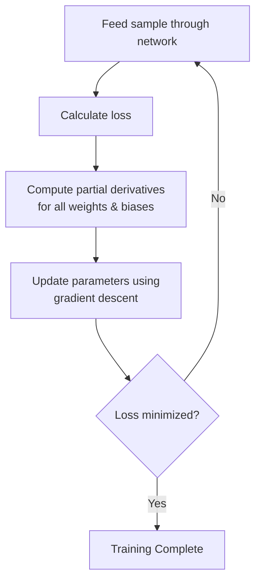
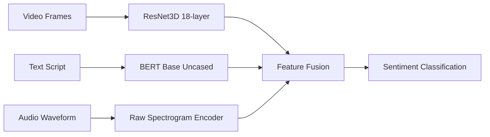
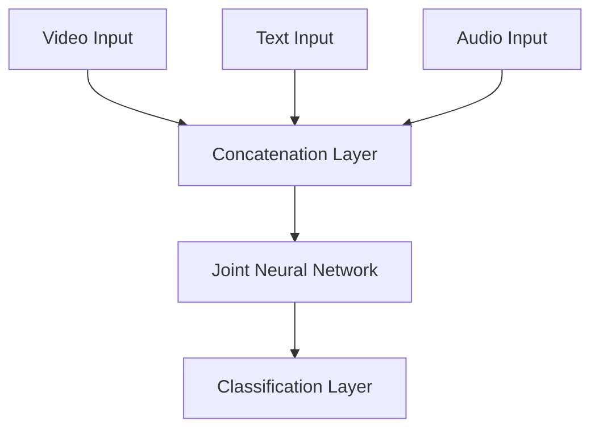
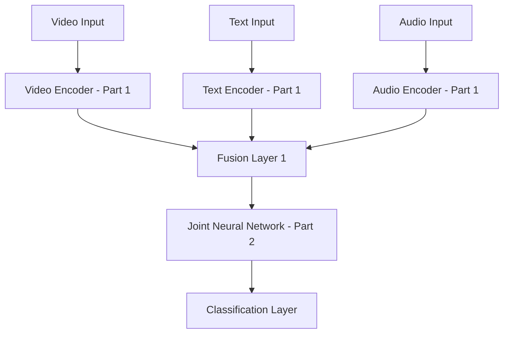
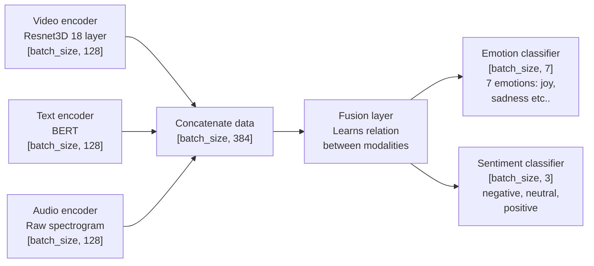

# Video Sentiment Analysis with Multi-Modal Deep Learning

## Project Overview

### What We're Building

This project implements a **multi-modal sentiment analysis system** for video content. The system processes uploaded videos through a deep learning model that analyzes visual, textual, and audio information to determine both sentiment and emotional content.

**Classification Output:**
- **Sentiment:** Negative, Neutral, or Positive
- **Emotions:** Happy, Sad, Angry, Fear, Surprise, Disgust, or Neutral

### Real-World Use Cases

This technology has numerous practical applications:

1. **Marketing & Advertising** - Companies can analyze how audiences perceive their video advertisements
2. **Content Creation** - YouTubers and content creators can measure audience reception and emotional response
3. **Research & Academia** - Researchers can conduct sentiment analysis studies on video data
4. **Social Media Monitoring** - Brands can track emotional responses to their video content
5. **Customer Feedback** - Businesses can analyze video testimonials and reviews

---


## Dataset: MELD (Multimodal EmotionLines Dataset)

### Dataset Overview

This project uses the **MELD dataset**, which contains video clips extracted from episodes of the TV show "Friends". The dataset is specifically designed for multimodal emotion recognition and sentiment analysis research.

**Key Details:**
- **Source:** Friends TV show episodes
- **Size:** ~10GB (plan your storage accordingly)
- **Modalities:** Video, audio, and text transcripts
- **Annotations:** Emotion labels and sentiment labels

⚠️ **Important:** Due to the large dataset size, ensure you have sufficient disk space before downloading.


---
## Neural Network Fundamentals

### Architecture Overview


### How Individual Neurons Work

A neuron is the fundamental computational unit of a neural network. Here's the step-by-step process:

1. **Input Reception:** The neuron receives multiple input values (x₁, x₂, ..., xₙ)
2. **Weight Application:** Each input has an associated weight (w₁, w₂, ..., wₙ) that determines its importance
3. **Weighted Sum:** The neuron calculates: `w₁×x₁ + w₂×x₂ + ... + wₙ×xₙ`
4. **Bias Addition:** A bias term (b) is added to shift the activation function
5. **Activation Function:** The result passes through a non-linear activation function
6. **Output:** The final value is passed to the next layer

**Mathematical Formula:**
```
y = f(w₁×x₁ + w₂×x₂ + ... + wₙ×xₙ + b)
```

Where:
- `y` = neuron output
- `f` = activation function (e.g., sigmoid, ReLU, tanh)
- `wᵢ` = weights for each input
- `xᵢ` = input values
- `b` = bias term

### Why Activation Functions Are Critical

**Without activation functions**, the neural network would simply be a linear regression model:

❌ **Problem with Pure Linearity:**
- Cannot learn complex, non-linear patterns
- Limited to representing only linear relationships
- Multiple layers collapse into a single linear transformation

✅ **Benefits of Non-Linear Activation Functions:**
- Enable learning of complex patterns and relationships
- Allow deep networks to represent sophisticated functions
- Introduce the capability to model real-world non-linear data

---


## Training Theory

### Simple Example

Let's walk through a simplified training example:

**Formula:**
```
y = sigmoid((x₁×w₁ + x₂×w₂) + b)
```

**Initial Setup (for simplicity):**
- Weights: `w₁ = w₂ = 0.5`
- Bias: `b = 0`

⚠️ **Note:** In real-world scenarios, weights and biases are initialized with random values, not fixed values like this example.

### The Training Process

#### Phase 1: Initialization
- **Before training:** Weights and biases are randomly initialized
- The model has no knowledge of patterns in the data
- Predictions are essentially random guesses

#### Phase 2: Training Loop

During training, we use a technique called **backpropagation** to iteratively improve the model:

1. **Forward Pass:** Feed input data through the network
2. **Calculate Error:** Compare prediction with expected output
3. **Backpropagation:** Calculate how much each weight/bias contributed to the error
4. **Update Parameters:** Adjust weights and biases to reduce error
5. **Repeat:** Continue for many iterations (epochs)

**The Learning Process:**
- We provide the AI with "hints" by showing input-output pairs
- The model learns correlations between inputs and outputs
- When predictions are far off, weights/biases are adjusted significantly
- When predictions are close, adjustments are smaller

#### Phase 3: After Training

- The model has learned optimal weights and biases
- When given new input (similar to training data), the model recognizes patterns
- Predictions become accurate and reliable

---
## Deep Dive: What Happens During Training

### Loss Functions: Measuring Error

**Key Principle:** Lower loss = Better accuracy

**Common Loss Functions:**
- **Mean Squared Error (MSE)** - Used for regression tasks
- **Cross-Entropy Loss** - Used for classification tasks (our case)

The loss function measures the difference between the model's predictions and the actual correct answers, then calculates the mean of all errors across the dataset.

### The Optimization Challenge

To improve the network, we need to determine **how much each weight and bias contributes to the total loss**.

**The Problem:**
```
Loss = L(w₁, w₂, ..., wₙ, b₁, b₂, ..., bₘ)
```

The loss function depends on **all weights and biases** in the network. How do we know which parameters affect the loss and by how much?

**The Solution: Partial Derivatives**

We use calculus (partial derivatives) to measure how much each individual weight and bias affects the loss function.

### Gradient Descent Algorithm


**Step-by-Step Process:**

1. **Calculate Gradients:** Compute the gradient (partial derivative) of the loss with respect to each parameter
   - Gradient tells us both **direction** and **magnitude** of change needed

2. **Update Parameters:** Move each parameter in the opposite direction of its gradient
   ```
   w₁_new = w₁_old - learning_rate × ∂L/∂w₁
   ```

3. **Learning Rate:** Controls how much we adjust parameters
   - ⚠️ **Too small:** Slow convergence, training takes forever
   - ⚠️ **Too large:** Overshooting the minimum, unstable training
   - ✅ **Just right:** Efficient convergence to optimal solution

4. **Iterate:** Repeat for many epochs until loss is minimized

### Complete Training Workflow



**Summary:**
1. Run training sample through network → Get prediction
2. Calculate loss (error)
3. Compute partial derivatives for all weights and biases
4. Update parameters using learning rate and gradients
5. Repeat for many epochs until loss converges

---

## Underfitting vs Overfitting

### Understanding Model Performance Issues


### Underfitting

**Definition:** Model is too simple to capture underlying patterns in the data.

**Characteristics:**
- ❌ Low accuracy on training data
- ❌ Low accuracy on validation data
- Model hasn't learned enough from the data

**Causes:**
- Insufficient model complexity
- Too few training iterations
- Over-regularization

### Overfitting

**Definition:** Model is too complex and learns noise as if it were a true pattern.

**Characteristics:**
- ✅ High accuracy on training data
- ❌ Low accuracy on validation data
- Model has memorized training data instead of learning general patterns

**Causes:**
- Excessive model complexity
- Too many training iterations
- Insufficient training data

### Preventing Overfitting

**Effective Techniques:**

1. **Regularization** - Add penalty for complex models (L1, L2 regularization)
2. **Dropout** - Randomly disable neurons during training to prevent co-adaptation
3. **Early Stopping** - Stop training when validation loss stops improving
4. **Data Augmentation** - Increase training data diversity
5. **Cross-Validation** - Use multiple validation sets to ensure generalization

**Goal:** Find the sweet spot where the model generalizes well to unseen data.

---

## Representing Data in Deep Learning

### The Fundamental Requirement

**Core Principle:** All data must be represented in **numerical format** for neural networks to process it.

**Tensor:** A multi-dimensional array that holds numerical data.

---

### Encoding Video Data

**Step-by-Step Process:**

1. **Frame Extraction**
   - Extract frames from video at regular intervals (e.g., every second)
   - Convert video stream into discrete image frames

2. **Feature Extraction**
   - Use pre-trained CNN (VGG16, ResNet, or ResNet3D) to extract features
   - Each frame is converted into a fixed-size feature vector
   - This captures important visual information in a compact representation

3. **Sequence Creation**
   - Stack feature vectors of all frames
   - Create a 2D array: `(num_frames × feature_vector_size)`

4. **Length Normalization**
   - **Problem:** Videos have varying lengths
   - **Solutions:**
     - **Padding:** Add zeros to shorter sequences
     - **Truncation:** Cut longer sequences to fixed length

5. **Tensor Formation**
   - Reshape into 3D tensor: `(1 × num_frames × feature_vector_size)`
   - Ready to feed into the sentiment analysis model

### Example: Video Tensor Representation

**Dimensions:** `[frames=3, channels=3, height=4, width=4]`

**PyTorch Tensor Storage:**

```python
video = torch.tensor([
                    # frame 1: req square in top left corner
                     [[[1.0, 1.0, 1.0, 1.0],
                       [1.0, 1.0, 1.0, 1.0],
                       [1.0, 1.0, 1.0, 1.0],
                       [1.0, 1.0, 1.0, 1.0]],

                      # frame 2: red square in top right corner
                      [[0.0, 0.0, 0.0, 1.0],
                       [0.0, 0.0, 0.0, 1.0],
                       [0.0, 0.0, 0.0, 1.0],
                       [0.0, 0.0, 0.0, 1.0]],

                      # frame 3: green square in bottom left corner
                      [[0.0, 1.0, 0.0, 0.0],
                       [0.0, 1.0, 0.0, 0.0],
                       [0.0, 1.0, 0.0, 0.0],
                       [0.0, 1.0, 0.0, 0.0]]]
])
```

---

### Encoding Text Data

**Text Processing Pipeline:**

1. **Tokenization**
   - Break text into smaller units (tokens)
   - Tokens can be words, subwords, or characters
   - Example: "Hello world" → ["Hello", "world"]

2. **Embedding**
   - Convert tokens into dense numerical vectors
   - Capture semantic meaning and relationships
   - **Techniques:**
     - Word2Vec
     - GloVe
     - **BERT** (our choice - transformer-based)

3. **Padding/Truncating**
   - Ensure all sequences have the same length
   - Add special padding tokens to shorter sequences
   - Truncate longer sequences to maximum length

4. **Final Representation**
   - 2D tensor: `(num_tokens × embedding_size)`
   - Ready for input to sentiment analysis model

---

### Encoding Audio Data

**Audio Processing:**
- Convert audio waveforms into numerical representations
- Use spectrograms to represent frequency content over time
- Raw spectrogram captures acoustic features for the model

---

## Our Multi-Modal Model Architecture

### Input Modalities

Our model processes three types of data:
1. **Video frames** - Visual information
2. **Text script** - Dialogue and captions
3. **Audio** - Sound and speech patterns

### Training Approaches

#### Option 1: Training from Scratch

❌ **Drawbacks:**
- Doesn't use pre-trained models
- Requires massive amounts of data
- Needs significantly more training time
- Often underperforms compared to transfer learning
- Higher computational cost

#### Option 2: Transfer Learning (Our Approach)

✅ **Benefits:**
- Fine-tune pre-trained models on our specific task
- Leverage knowledge learned from large datasets
- Faster training and better performance
- More efficient use of resources

**Pre-trained Models Used:**
- **Video:** VGG16, ResNet, or ResNet3D
- **Text:** BERT (Bidirectional Encoder Representations from Transformers)
- **Audio:** Wav2Vec or raw spectrogram processing

---

### Our Implementation

**Encoder Architecture:**



**Component Details:**
- **Video Encoder:** ResNet3D (18 layers) → Extracts spatial-temporal features
- **Text Encoder:** BERT Base Uncased → Captures semantic meaning
- **Audio Encoder:** Raw Spectrogram → Processes acoustic features
- **Fusion Layer:** Combines all three modality outputs
- **Classification Heads:** Sentiment (3 classes) + Emotion (7 classes)

---

## Multi-Modal Fusion Strategies

### Three Approaches to Combining Modalities

---

### 1. Late Fusion (Our Choice) ✅


 ```mermaid
 
graph TD
    A[Video Input] --> B[Video Encoder]
    C[Text Input] --> D[Text Encoder]
    E[Audio Input] --> F[Audio Encoder]
    B --> G[Fusion Layer]
    D --> G
    F --> G
    G --> H[Classification Layer]
```

---

### 2. Early Fusion

**Process:**
- Combine **raw input data** from all modalities at the input level
- Feed combined data into a **single joint neural network**
- Process all modalities together from the beginning

**Advantages:**
- One unified model captures interactions from the start
- More efficient at learning cross-modal relationships
- Can discover low-level correlations between modalities

**Disadvantages:**
- More complex to implement and tune
- Requires more training data to learn effectively
- Very sensitive to missing modalities
- Harder to use pre-trained models
- Less flexible architecture



---

### 3. Hybrid/Intermixed Fusion

**Process:**
- Process each modality separately for initial layers
- Extract modality-specific features first
- Combine intermediate representations at **multiple fusion points**
- Continue joint processing before final classification

**Advantages:**
- **Best of both worlds:** Balances modality-specific and joint learning
- Captures both low-level and high-level interactions
- More expressive than late fusion alone
- Better generalization than pure early fusion

**Disadvantages:**
- Most complex to implement
- Requires careful design of fusion points
- More hyperparameters to tune
- Longer training time



---

## Our Late Fusion Implementation Details


### Detailed Architecture Breakdown



### Architecture Components

**1. Encoder Outputs:**
- **Video Encoder (ResNet3D 18-layer):** `[batch_size, 128]`
- **Text Encoder (BERT):** `[batch_size, 128]`
- **Audio Encoder (Raw Spectrogram):** `[batch_size, 128]`

Each encoder outputs a 128-dimensional feature vector representing its modality.

**2. Concatenation Layer:**
- Combines all three encoders: `[batch_size, 384]`
- Simple concatenation: `[128 + 128 + 128 = 384]`

**3. Fusion Layer:**
- Learns cross-modal relationships
- Discovers correlations between video, text, and audio features
- Transforms concatenated features into unified representation

**4. Classification Heads (Multi-Task Learning):**

**Emotion Classifier:**
- Output: `[batch_size, 7]`
- **7 emotion classes:** Joy, Sadness, Anger, Fear, Surprise, Disgust, Neutral

**Sentiment Classifier:**
- Output: `[batch_size, 3]`
- **3 sentiment classes:** Negative, Neutral, Positive

**Multi-Task Learning Benefits:**
- Shared representations improve both tasks
- Emotion and sentiment are related but distinct
- Joint training leads to better feature learning

---


## Implementation Roadmap

### Development Plan

Here's the step-by-step plan for coding our multi-modal sentiment analysis model:

---

### Phase 1: Data Preparation

**1.1 Dataset Download**
- Download the MELD dataset (~10GB)
- Verify data integrity
- Organize file structure

**1.2 PyTorch Dataset Class**
- Implement custom `torch.utils.data.Dataset` class
- Handle video, text, and audio loading
- Implement data preprocessing pipelines
- Add data augmentation strategies

---

### Phase 2: Model Architecture

**2.1 Encoders Implementation**
- **Video Encoder:** Load pre-trained ResNet3D (18 layers)
- **Text Encoder:** Load pre-trained BERT Base Uncased
- **Audio Encoder:** Implement spectrogram processing
- Fine-tune each encoder for our task

**2.2 Fusion Layer**
- Implement concatenation layer
- Design fusion network architecture
- Add cross-modal attention mechanisms (optional)

**2.3 Classification Heads**
- Emotion classifier (7 classes)
- Sentiment classifier (3 classes)
- Implement multi-task learning framework

---

### Phase 3: Training Pipeline

**3.1 Loss Functions**
- Cross-entropy loss for both tasks
- Weighted multi-task loss
- Regularization terms

**3.2 Optimization**
- Adam or AdamW optimizer
- Learning rate scheduling
- Gradient clipping

**3.3 Training Loop**
- Implement training and validation loops
- Add checkpointing
- Implement early stopping
- Log metrics (TensorBoard/Weights & Biases)

---

### Phase 4: Evaluation

**4.1 Metrics Implementation**
- Accuracy
- Precision, Recall, F1-score
- Confusion matrix
- Per-class performance analysis

**4.2 Validation Strategy**
- K-fold cross-validation
- Hold-out test set evaluation
- Error analysis

---

### Phase 5: Deployment

**5.1 Model Packaging**
- Export trained model
- Create inference pipeline
- Optimize for production (quantization, pruning)

**5.2 Deployment Options**
- REST API (Flask/FastAPI)
- Web service (Docker container)
- Cloud deployment (AWS/GCP/Azure)
- Real-time inference optimization

---

## Key Takeaways

### What We've Learned

✅ **Neural Network Fundamentals:** Understanding neurons, activation functions, and non-linearity

✅ **Training Process:** Backpropagation, gradient descent, and optimization

✅ **Multi-Modal Learning:** Combining video, text, and audio for richer analysis

✅ **Transfer Learning:** Leveraging pre-trained models for better performance

✅ **Fusion Strategies:** Late fusion provides simplicity and flexibility

✅ **Multi-Task Learning:** Joint emotion and sentiment classification

### Next Steps

1. Set up development environment
2. Download and explore MELD dataset
3. Implement data loading pipeline
4. Build and test individual encoders
5. Integrate fusion layer
6. Train and evaluate model
7. Deploy for real-world use

---

**Ready to start building?** Let's turn this theory into a working sentiment analysis system! 🚀