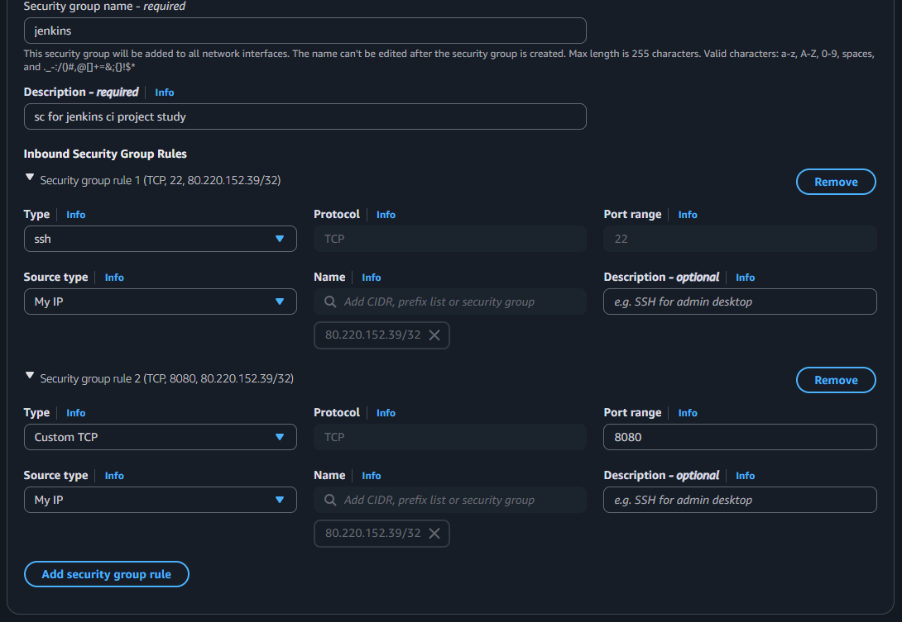
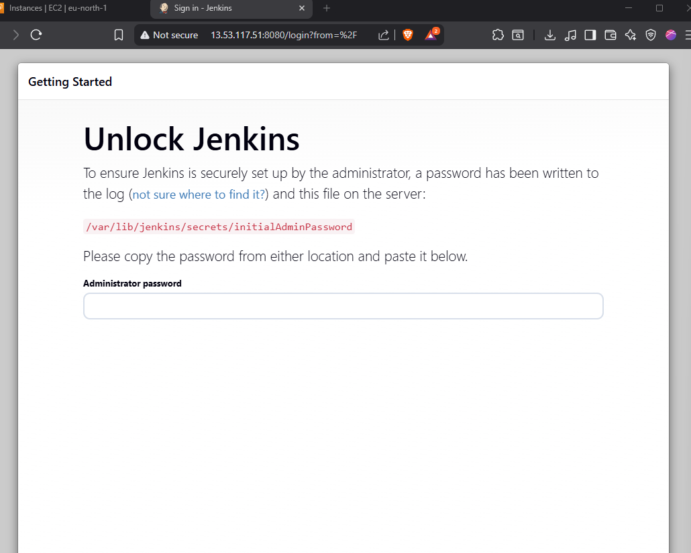

# Containerizing a Microservice E-Commerce Application with Docker

## Introduction

Today we'll walk through how to containerize a microservice application using Docker. Microservice architecture has become the standard for modern software development because it allows teams to deliver features quickly and efficiently. As a DevOps engineer, you'll definitely encounter microservice applications, and knowing how to containerize them is essential.

## Application Architecture

Our e-commerce application consists of **six services** that work together:

### 1. **Nginx API Gateway** (Port 80)
Acts as the reverse proxy and entry point for all requests. It routes traffic to the appropriate microservice based on the URL path.

### 2. **Client Service** (Port 4200)
The frontend application built with **Angular 12**. This loads the website pages that users interact with.

### 3. **Node API** (Port 5000)
Backend REST API built with **Node.js and Express**. Handles products, categories, and orders. Routes are prefixed with `/api`.

### 4. **Java API** (Port 9000)
Backend REST API built with **Spring Boot**. Manages the books catalog. Routes are prefixed with `/webapi`.

### 5. **MongoDB** (Port 27017)
NoSQL database for the Node API. Stores products, categories, and order data.

### 6. **MySQL** (Port 3306)
SQL database for the Java API. Stores books information.

### How Services Communicate

```
User Request → Nginx API Gateway → Routes based on URL path:
  └─ /         → Angular Client (port 4200)
  └─ /api      → Node.js API (port 5000) → MongoDB
  └─ /webapi   → Java API (port 9000) → MySQL
```

## Getting Started

### Step 1: Clone the Repository

Clone the code and open it in your favorite IDE.

### Step 2: Containerize the Angular Client

Navigate to the `client` folder and create a Dockerfile. We'll use a **multi-stage build** to optimize the image size:

**File: `client/Dockerfile`**

```dockerfile
FROM node:14 AS web-build
WORKDIR /usr/src/app
COPY ./ ./client
RUN cd client && npm install && npm run build --prod

# Use official nginx image as the base image
FROM nginx:latest

# Copy the build output to replace the default nginx contents.
COPY --from=web-build /usr/src/app/client/dist/client/ /usr/share/nginx/html
COPY nginx.conf /etc/nginx/conf.d/default.conf

# Expose port 4200
EXPOSE 4200
```

**What's happening here?**

- **Stage 1 (web-build)**: Uses Node.js 14 to install dependencies and build the Angular application for production.
- **Stage 2**: Uses the official Nginx image to serve the built static files. This keeps the final image small since we don't need Node.js in production.

**Nginx Configuration for Angular**

Create `client/nginx.conf` to configure how Nginx serves the Angular app:

```nginx
server {
    listen       4200;
    listen  [::]:4200;
    server_name  localhost;

    location / {
        root   /usr/share/nginx/html;
        index  index.html index.htm;
    }

    error_page   500 502 503 504  /50x.html;
    location = /50x.html {
        root   /usr/share/nginx/html;
    }
}
```

This configuration tells Nginx to listen on port 4200 and serve files from `/usr/share/nginx/html`.

### Step 3: Containerize the Node.js API

Navigate to the `nodeapi` folder and create a Dockerfile:

**File: `nodeapi/Dockerfile`**

```dockerfile
FROM node:14 AS nodeapi-build
WORKDIR /usr/src/app
COPY ./ ./nodeapi/
RUN cd nodeapi && npm install

FROM node:14
WORKDIR /usr/src/app/
COPY --from=nodeapi-build /usr/src/app/nodeapi/ ./
RUN ls
EXPOSE 5000
CMD ["/bin/sh", "-c", "cd /usr/src/app/ && npm start"]
```

**What's happening here?**

- **Stage 1**: Installs all npm dependencies.
- **Stage 2**: Copies the application with dependencies and starts the Node.js server on port 5000.

### Step 4: Containerize the Java API

Navigate to the `javaapi` folder and create a Dockerfile:

**File: `javaapi/Dockerfile`**

```dockerfile
FROM eclipse-temurin:8-jdk AS BUILD_IMAGE
WORKDIR /usr/src/app/
RUN apt update && apt install maven -y
COPY ./ /usr/src/app/
RUN mvn install -DskipTests

FROM eclipse-temurin:8-jre

WORKDIR /usr/src/app/
COPY --from=BUILD_IMAGE /usr/src/app/target/book-work-0.0.1-SNAPSHOT.jar ./book-work-0.0.1.jar

EXPOSE 9000
ENTRYPOINT ["java","-jar","book-work-0.0.1.jar"]
```

**What's happening here?**

- **Stage 1 (BUILD_IMAGE)**: Uses Eclipse Temurin JDK 8 to compile the Java application with Maven.
- **Stage 2**: Uses Eclipse Temurin JRE 8 (smaller image) to run the compiled JAR file. This reduces the final image size significantly.

> **Note**: We use Eclipse Temurin instead of the deprecated OpenJDK images.

### Step 5: Configure the Nginx API Gateway

We don't build a separate Nginx image for the API gateway. Instead, we use the official Nginx image from Docker Hub and attach our configuration as a volume.

**Why two Nginx instances?**

1. **Angular Nginx**: Serves the Angular static files on port 4200.
2. **API Gateway Nginx**: Routes incoming requests to the appropriate microservice based on the URL path on port 80.

**File: `nginx/default.conf`**

```nginx
upstream client {
    server client:4200;
}

server {
    listen 80;
    
    # Routes to Angular client
    location / {
        proxy_set_header Host $host;
        proxy_set_header X-Real-IP $remote_addr;
        proxy_set_header X-Forwarded-For $proxy_add_x_forwarded_for;
        proxy_set_header X-Forwarded-Proto $scheme; 

        proxy_http_version 1.1;
        proxy_set_header Upgrade $http_upgrade;
        proxy_set_header Connection "upgrade";
        proxy_pass http://client/;
    }
    
    # Routes to Node.js API
    location /api {
        proxy_pass http://api:5000;
    }
    
    # Routes to Java API
    location /webapi {
        proxy_pass http://webapi:9000;
    }
}
```

**What's happening here?**

- Requests to `/` are forwarded to the Angular client container.
- Requests to `/api` are forwarded to the Node.js API container on port 5000.
- Requests to `/webapi` are forwarded to the Java API container on port 9000.

### Step 6: Create Docker Compose Configuration

Now we bring all services together with Docker Compose. Create a `docker-compose.yaml` file in the root directory:

**File: `docker-compose.yaml`**

```yaml
version: "3.8"

services:
  # Angular application
  client:
    build:
      context: ./client
    ports:
      - "4200:4200"
    container_name: client
    depends_on:
      - api
      - webapi

  # Node.js API
  api:
    build:
      context: ./nodeapi
    ports:
      - "5000:5000"
    restart: always
    container_name: api
    depends_on:
      - nginx
      - emongo

  # Java API
  webapi:
    build:
      context: ./javaapi
    ports:
      - "9000:9000"
    restart: always
    container_name: webapi
    depends_on:
      - emartdb

  # Nginx API Gateway
  nginx:
    restart: always
    image: nginx:latest
    container_name: nginx
    volumes:
      - "./nginx/default.conf:/etc/nginx/conf.d/default.conf"
    ports:
      - "80:80"

  # MongoDB database
  emongo:
    image: mongo:4
    container_name: emongo
    environment:
      - MONGO_INITDB_DATABASE=epoc
    ports:
      - "27017:27017"

  # MySQL database
  emartdb:
    image: mysql:8.0.33
    container_name: emartdb
    ports:
      - "3306:3306"
    environment:
      - MYSQL_ROOT_PASSWORD=emartdbpass
      - MYSQL_DATABASE=books
```

**Understanding the Docker Compose File:**

#### Service 1: Client (Angular)
- Builds the image from the `client/Dockerfile`
- Maps container port 4200 to host port 4200
- Depends on `api` and `webapi` services

#### Service 2: API (Node.js)
- Builds the image from the `nodeapi/Dockerfile`
- Maps container port 5000 to host port 5000
- `restart: always` ensures the container restarts if it stops
- Depends on `nginx` and `emongo` services

#### Service 3: WebAPI (Java)
- Builds the image from the `javaapi/Dockerfile`
- Maps container port 9000 to host port 9000
- `restart: always` ensures automatic restart on failure
- Depends on `emartdb` service

#### Service 4: Nginx (API Gateway)
- Uses the official Nginx image from Docker Hub
- Maps container port 80 to host port 80
- Mounts the `nginx/default.conf` file as a volume for configuration

#### Service 5: EMongo (MongoDB)
- Uses the official MongoDB 4 image
- Maps container port 27017 to host port 27017
- Initializes with database name `epoc`

#### Service 6: EMartDB (MySQL)
- Uses MySQL 8.0.33 image
- Maps container port 3306 to host port 3306
- Sets root password to `emartdbpass`
- Creates database named `books`

## Key Concepts Summary

Before building and running, let's understand the core concepts:

### 1. Containerization Basics
Containerization is about:
- Writing **Dockerfiles** for each service
- Writing a **docker-compose.yaml** file to orchestrate multiple services
- Writing **configuration files** for services that need custom settings (like Nginx)

### 2. You Don't Need to Understand Everything
You **don't need** to understand every single line of code to containerize an application. You just need a basic understanding of:
- **What the application does** (e.g., Angular returns HTML, Node.js runs an Express API, Java runs a Spring Boot API)
- **How to host it** (e.g., Angular → host on Nginx, Node.js API → host on Node server, Java Spring Boot → host on embedded Tomcat)

### 3. Multi-Stage Builds
We use multi-stage builds to:
- **Reduce image size**: Only production dependencies end up in the final image
- **Separate build and runtime**: Build tools stay in the build stage, runtime only gets what's needed

### 4. Service Communication in Docker
- In **development**: Services call `localhost:PORT`
- In **Docker**: Service names replace localhost (e.g., `emongo`, `emartdb`, `api`, `webapi`)
- Docker's internal DNS resolves service names to container IPs

## Build and Run

Now we're ready to build and run the application!

### Build all services:
```bash
docker compose build
```

This command builds Docker images for all services defined in `docker-compose.yaml`.

### Start all services:
```bash
docker compose up
```

This command starts all containers. You can add `-d` flag to run in detached mode (background).

### Access the Application

Visit **http://localhost** in your browser. You should see the EMart homepage where you can:
- Create a new account
- Login
- View products
- Place orders
- Test the Java API by clicking on "Try BookSmart"





## Clean Up

When you're done testing, clean up the resources:

### Stop and remove all containers:
```bash
docker compose down
```

### Remove all unused images and containers:
```bash
docker system prune -a
```

**Warning**: This removes all stopped containers, unused networks, dangling images, and build cache. Use with caution!

## Conclusion

Congratulations! You've successfully containerized a complete microservice e-commerce application with Docker. You now understand:

- How to write Dockerfiles for different technology stacks (Angular, Node.js, Java)
- How to use multi-stage builds for optimization
- How to configure Nginx as an API gateway
- How to orchestrate multiple services with Docker Compose
- How services communicate within Docker networks

This knowledge is essential for any DevOps engineer working with modern microservice architectures.