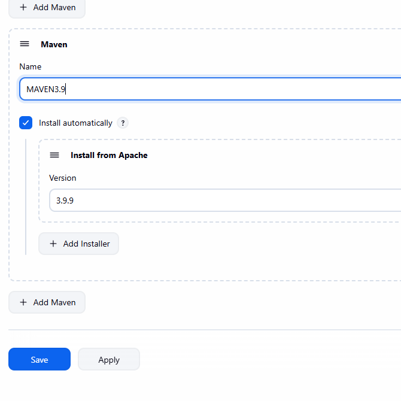
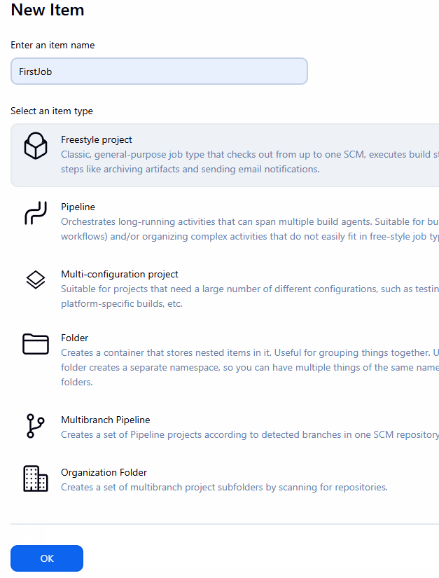
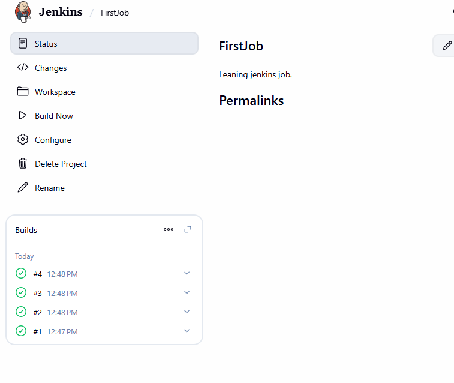
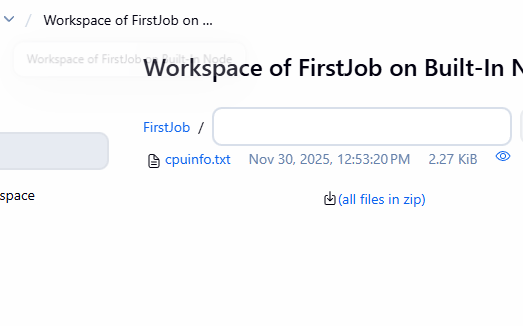
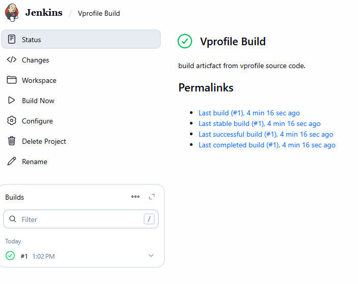
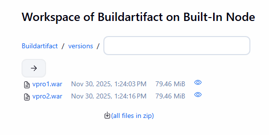

### what tool we nned to buuild our project
check a look the the code base here:
https://github.com/vvduth/vprofile-project
what tools do we need to build this project?
- git
- maven
- java jdk
So Jenkins might give you

the tools or plugins in the frontend, right,

but in the backend, actually it is executing

those commands on the machine.

So whenever you need to install tools in Jenkins,

you have to remember two things.

One, there is a plugin

that is the frontend and the second,

you need the tool to be installing the system itself, right?

I'm talking about here, right?

We can install app install Maven or app to install Java,

stuff like that.

view the list of plugins isntall for Jenkins on ur machine in manage => tools tab

add maven 


add jdk installation:
for java, we already installed openjdk-21-jdk on the system, but our project work on jdk 17, so we need to add jdk 17 in jenkins, we can so intall automatically by jenkins but it is comolicated, so we will do it manually.
log in to ec2 install and insatl jdk 17
```bash
sudo apt install openjdk-17-jdk -y
```
get the JAVA_HOME path
```bash
root@ip-172-31-29-194:~# ls /usr/lib/jvm
java-1.17.0-openjdk-amd64  java-1.21.0-openjdk-amd64  java-17-openjdk-amd64  java-21-openjdk-amd64  openjdk-17  openjdk-21
```
so the path is /usr/lib/jvm/java-17-openjdk-amd64

### create our first job
- on jenkins dashboard, click on "New Item", chhose freestyle project

over view on the configure the job
- give the job description =>   "Build vprofile project from github repo"
- source code management => git, but ig you have more plugin, you can see more option like svn, mercurial etc, bitbucket etc
- build trigger  : how to triiger a job => no thing for now
- build environment: set up the build environment => do nothing for now
- build step: what command to run, we choose execute shell => cuz we ran on ubuntu terminal,
- put this in the text area
```bash
whoami
pwd
w
id
```

click save => click build now few times


see the output 
```
Started by user Duc Thai
Running as SYSTEM
Building in workspace /var/lib/jenkins/workspace/FirstJob
[FirstJob] $ /bin/sh -xe /tmp/jenkins8795589297149698121.sh
+ whoami
jenkins
+ pwd
/var/lib/jenkins/workspace/FirstJob
+ w
 12:48:22 up 47 min,  1 user,  load average: 0.03, 0.02, 0.00
USER     TTY      FROM             LOGIN@   IDLE   JCPU   PCPU  WHAT
ubuntu            80.220.152.39    12:01   44:00   0.00s  0.02s sshd: ubuntu [priv]
+ id
uid=111(jenkins) gid=113(jenkins) groups=113(jenkins)
Finished: SUCCESS
```


### add one mo build step
* beck to confire, add one more build step, add this 
  ```
  sudo apt update
  ```
=> this will fail cuz jenkins user do not have sudo rights

chang ethe command to 
```
cat /proc/cpuinfo > cpuinfo.txt
```
=> this will work fine and you can see the cpuinfo.txt file in the workspace folder



==> jenkin is no JOKE

### create a build job
let äs  create a build job.

In that job we are going to fetch the source code

from our source code repository, GitHub, build it

by using Maven tool and then archive the artifact.

1. go to mamage jenkins => tool => add jdk 21 into jek installationm (yes i know we have jdk 17, i will explain later why we need to add jdk 21)
2. create new job => freestyle project => name it "Vprofile Build" (or any name you like)
3. configure the job as below:
   1.  jdk : choose jdk 17
   2. source code management: git => put the repo link, branch: */atom
   3. no need credential, cuz it is public repo 
   4. build step: Invoke top-level Maven targets
      1. maven version: maven 3.9.9 (name MAVEN3.9) (the one we installed in jenkins tool)
      2. goals and options: isntall
   5. post build action: archive the artifacts
      3. files to archive: **/*.war
click save => build noew


### versionong and variables
* create a new job withh name "Vprofile Build with versioning"
* copy the config from "Vprofile Build" job
* in the buils tep add one more build step after maven build step
  * choose execute shell
  * put this command
  ```bash
  mkdir -p versions
cp target/vprofile-v2.war versions/vpro$BUILD_ID.war
  ```

  save and run few times, you will see the verions folder in the workspace with different war file name

  

### Parameterized build
* create a new job with name "Vprofile Build with Parameters"
* check the "This project is parameterized" box
* add a string parameter
  * name: VERSION
  * default value: v1.0.0
  * description: version number for the build artifact
* in the build step, after maven build step, add one more build step execute shell
    * put this command
    ```bash
    mkdir -p versions
    cp target/vprofile-v2.war versions/vprofile-$VERSION.war
    ```
* save and run the job (build with parameters, no longer build now button)
  * put the version: v2.0.0