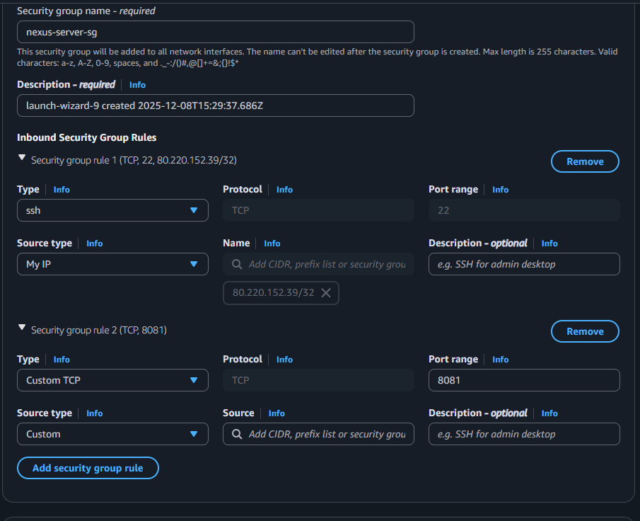
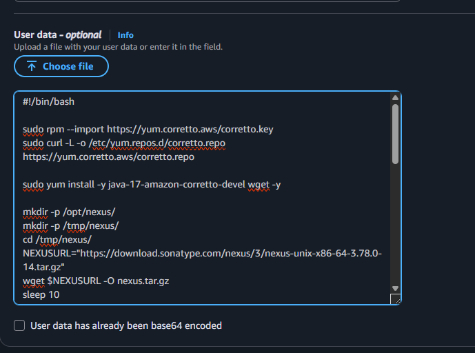
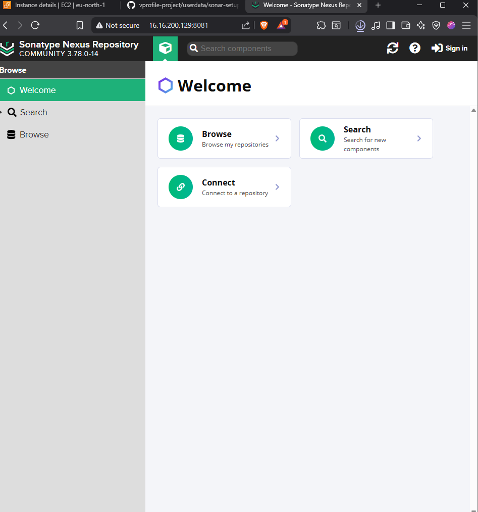
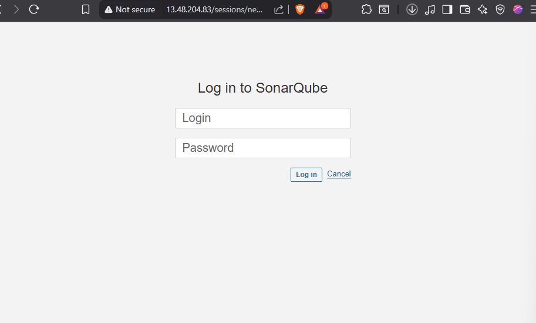
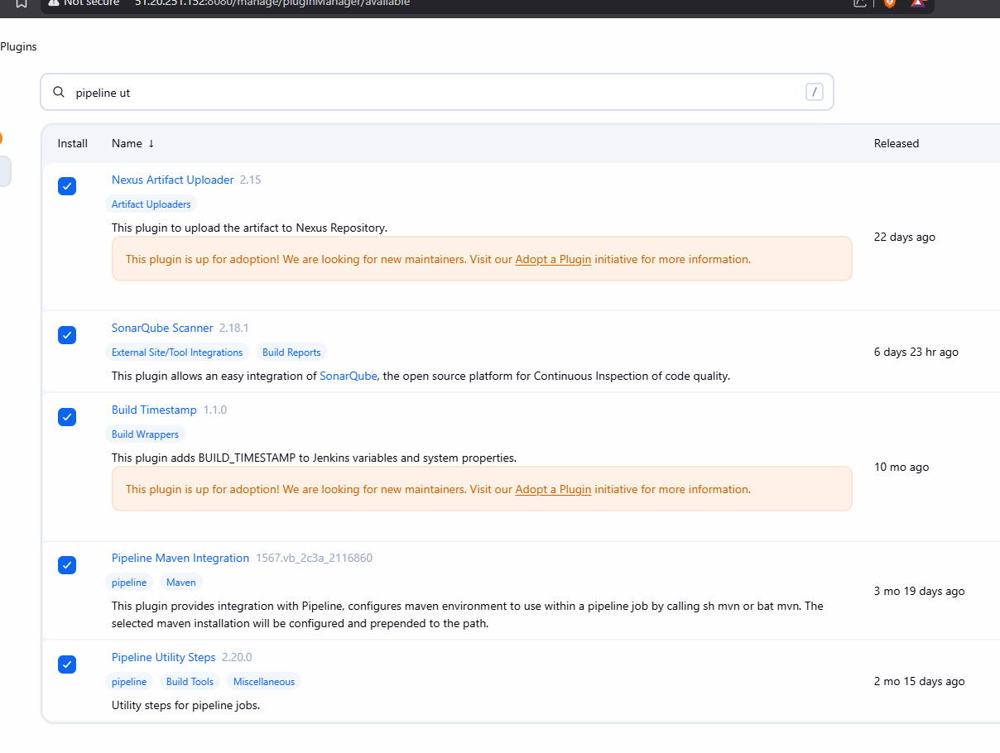

# Building a CI/CD Pipeline with Jenkins

## Table of Contents
- [Building a CI/CD Pipeline with Jenkins](#building-a-cicd-pipeline-with-jenkins)
  - [Table of Contents](#table-of-contents)
  - [Pipeline Overview](#pipeline-overview)
  - [The CI/CD Flow](#the-cicd-flow)
  - [Tools Used](#tools-used)
  - [Main Steps for Setup](#main-steps-for-setup)
  - [Setting Up Nexus Repository](#setting-up-nexus-repository)
    - [Nexus Setup Script](#nexus-setup-script)
    - [Security Group for Nexus](#security-group-for-nexus)
  - [Setting Up SonarQube Server](#setting-up-sonarqube-server)
    - [SonarQube Setup Script](#sonarqube-setup-script)
    - [Security Group for SonarQube](#security-group-for-sonarqube)
  - [Verifying Installations](#verifying-installations)
    - [Verify Nexus](#verify-nexus)
    - [Verify SonarQube](#verify-sonarqube)
  - [Jenkins Plugin Installation](#jenkins-plugin-installation)

---

## Pipeline Overview

In this guide, we will set up a complete Continuous Integration (CI) pipeline. We will understand the flow, set up the necessary servers (Nexus and SonarQube), and integrate them with Jenkins.

---

## The CI/CD Flow

The pipeline follows a standard DevOps workflow:

1. **Code Commit:** Developer writes code and pushes changes to a centralized repository (GitHub).
2. **Fetch Code:** Jenkins detects the change and fetches the code using the Git plugin.
3. **Build:** Jenkins builds the code using Maven (since it's a Java project).
4. **Unit Test:** Maven executes unit tests included in the source code.
5. **Code Analysis:** 
   - The code is scanned for vulnerabilities, bugs, and best practices using SonarQube Scanner and Checkstyle.
   - Reports are uploaded to the SonarQube server.
6. **Quality Gate:** SonarQube checks if the code meets quality standards. If it fails, the pipeline stops.
7. **Artifact Generation:** If all checks pass, a verified artifact is generated and stored in the Nexus repository.
8. **Notification:** The team is notified of the build status.

---

## Tools Used

We will use the following tools for this example, but the concepts apply to any toolset:

- **Jenkins:** CI/CD Automation Server
- **Git/GitHub:** Version Control System
- **Maven:** Build Tool for Java
- **SonarQube:** Code Quality and Security Analysis
- **Nexus:** Artifact Repository Manager

---

## Main Steps for Setup

To create this pipeline, we will execute the following steps:

1. **Set up Servers:** Launch EC2 instances for Nexus and SonarQube using user-data scripts.
2. **Security Groups:** Configure security groups to allow communication between Jenkins, Nexus, and SonarQube.
3. **Install Plugins:** Install necessary Jenkins plugins (Nexus, SonarQube, Git, Maven, etc.).
4. **Integrate Tools:** Connect Jenkins with Nexus and SonarQube.
5. **Create Pipeline:** Write and execute the pipeline script.
6. **Notifications:** Set up automated notifications for build status.

---

## Setting Up Nexus Repository

Nexus will be used as our artifact repository manager. We will run it on an **Amazon Linux 2023** EC2 instance (t3.medium recommended).

### Nexus Setup Script

Use the following script in the EC2 user-data to automate the installation:

```bash
#!/bin/bash

# Import keys and repositories
sudo rpm --import https://yum.corretto.aws/corretto.key
sudo curl -L -o /etc/yum.repos.d/corretto.repo https://yum.corretto.aws/corretto.repo

# Install Java 17 (Required for Nexus)
sudo yum install -y java-17-amazon-corretto-devel wget -y

# Create directories
mkdir -p /opt/nexus/
mkdir -p /tmp/nexus/
cd /tmp/nexus/

# Download Nexus
NEXUSURL="https://download.sonatype.com/nexus/3/nexus-unix-x86-64-3.78.0-14.tar.gz"
wget $NEXUSURL -O nexus.tar.gz
sleep 10

# Extract Nexus
EXTOUT=`tar xzvf nexus.tar.gz`
NEXUSDIR=`echo $EXTOUT | cut -d '/' -f1`
sleep 5
rm -rf /tmp/nexus/nexus.tar.gz
cp -r /tmp/nexus/* /opt/nexus/
sleep 5

# Create Nexus user
useradd nexus
chown -R nexus.nexus /opt/nexus

# Create Systemd Service
cat <<EOT>> /etc/systemd/system/nexus.service
[Unit]
Description=nexus service
After=network.target

[Service]
Type=forking
LimitNOFILE=65536
ExecStart=/opt/nexus/$NEXUSDIR/bin/nexus start
ExecStop=/opt/nexus/$NEXUSDIR/bin/nexus stop
User=nexus
Restart=on-abort

[Install]
WantedBy=multi-user.target

EOT

# Configure run user
echo 'run_as_user="nexus"' > /opt/nexus/$NEXUSDIR/bin/nexus.rc

# Start Service
systemctl daemon-reload
systemctl start nexus
systemctl enable nexus
```

**What this script does:**
- Installs Java 17
- Downloads and extracts Nexus
- Creates a dedicated `nexus` user
- Configures Nexus as a system service to start on boot

### Security Group for Nexus
- Allow **Inbound Port 8081** from Jenkins EC2 and your IP address.



Paste the nexus script in user data and launch the instance.



---

## Setting Up SonarQube Server

SonarQube will be used for code analysis. We will run it on an **Ubuntu 24** EC2 instance (t3.medium recommended).

### SonarQube Setup Script

Use the following script in the EC2 user-data:

```bash
#!/bin/bash

# System Configuration for SonarQube (Required for Elasticsearch)
cp /etc/sysctl.conf /root/sysctl.conf_backup
cat <<EOT> /etc/sysctl.conf
vm.max_map_count=262144
fs.file-max=65536
ulimit -n 65536
ulimit -u 4096
EOT

cp /etc/security/limits.conf /root/sec_limit.conf_backup
cat <<EOT> /etc/security/limits.conf
sonarqube   -   nofile   65536
sonarqube   -   nproc    409
EOT

# Install Java 17
sudo apt-get update -y
sudo apt-get install openjdk-17-jdk -y
sudo update-alternatives --config java

# Install PostgreSQL
sudo apt update
wget -q https://www.postgresql.org/media/keys/ACCC4CF8.asc -O - | sudo apt-key add -
sudo sh -c 'echo "deb http://apt.postgresql.org/pub/repos/apt/ `lsb_release -cs`-pgdg main" >> /etc/apt/sources.list.d/pgdg.list'
sudo apt install postgresql postgresql-contrib -y
sudo systemctl enable postgresql.service
sudo systemctl start postgresql.service

# Configure Database
sudo echo "postgres:admin123" | chpasswd
runuser -l postgres -c "createuser sonar"
sudo -i -u postgres psql -c "ALTER USER sonar WITH ENCRYPTED PASSWORD 'admin123';"
sudo -i -u postgres psql -c "CREATE DATABASE sonarqube OWNER sonar;"
sudo -i -u postgres psql -c "GRANT ALL PRIVILEGES ON DATABASE sonarqube to sonar;"
systemctl restart postgresql

# Install SonarQube
sudo mkdir -p /sonarqube/
cd /sonarqube/
sudo curl -O https://binaries.sonarsource.com/Distribution/sonarqube/sonarqube-9.9.8.100196.zip
sudo apt-get install zip -y
sudo unzip -o sonarqube-9.9.8.100196.zip -d /opt/
sudo mv /opt/sonarqube-9.9.8.100196/ /opt/sonarqube

# Create User and Permissions
sudo groupadd sonar
sudo useradd -c "SonarQube - User" -d /opt/sonarqube/ -g sonar sonar
sudo chown sonar:sonar /opt/sonarqube/ -R

# Configure SonarQube Properties
cp /opt/sonarqube/conf/sonar.properties /root/sonar.properties_backup
cat <<EOT> /opt/sonarqube/conf/sonar.properties
sonar.jdbc.username=sonar
sonar.jdbc.password=admin123
sonar.jdbc.url=jdbc:postgresql://localhost/sonarqube
sonar.web.host=0.0.0.0
sonar.web.port=9000
sonar.web.javaAdditionalOpts=-server
sonar.search.javaOpts=-Xmx512m -Xms512m -XX:+HeapDumpOnOutOfMemoryError
sonar.log.level=INFO
sonar.path.logs=logs
EOT

# Create Systemd Service
cat <<EOT> /etc/systemd/system/sonarqube.service
[Unit]
Description=SonarQube service
After=syslog.target network.target

[Service]
Type=forking
ExecStart=/opt/sonarqube/bin/linux-x86-64/sonar.sh start
ExecStop=/opt/sonarqube/bin/linux-x86-64/sonar.sh stop
User=sonar
Group=sonar
Restart=always
LimitNOFILE=65536
LimitNPROC=4096

[Install]
WantedBy=multi-user.target
EOT

systemctl daemon-reload
systemctl enable sonarqube.service

# Install and Configure Nginx (Reverse Proxy)
apt-get install nginx -y
rm -rf /etc/nginx/sites-enabled/default
rm -rf /etc/nginx/sites-available/default
cat <<EOT> /etc/nginx/sites-available/sonarqube
server{
    listen      80;
    server_name sonarqube.groophy.in;
    access_log  /var/log/nginx/sonar.access.log;
    error_log   /var/log/nginx/sonar.error.log;
    proxy_buffers 16 64k;
    proxy_buffer_size 128k;
    location / {
        proxy_pass  http://127.0.0.1:9000;
        proxy_next_upstream error timeout invalid_header http_500 http_502 http_503 http_504;
        proxy_redirect off;
        proxy_set_header    Host            \$host;
        proxy_set_header    X-Real-IP       \$remote_addr;
        proxy_set_header    X-Forwarded-For \$proxy_add_x_forwarded_for;
        proxy_set_header    X-Forwarded-Proto http;
    }
}
EOT
ln -s /etc/nginx/sites-available/sonarqube /etc/nginx/sites-enabled/sonarqube
systemctl enable nginx.service
sudo ufw allow 80,9000,9001/tcp

# Reboot to apply system changes
echo "System reboot in 30 sec"
sleep 30
reboot
```

**What this script does:**
- Configures system limits (required for SonarQube/Elasticsearch)
- Installs Java 17 and PostgreSQL
- Creates a database for SonarQube
- Installs SonarQube and configures it to use PostgreSQL
- Sets up Nginx as a reverse proxy (access on port 80)

### Security Group for SonarQube
- Allow **Inbound Port 80** from Jenkins EC2 and your IP address.
- Allow **Inbound Port 9000** (if accessing directly without Nginx).

---

## Verifying Installations

### Verify Nexus
1. SSH into Nexus EC2:
   ```bash
   ssh -i your-key.pem ec2-user@your-nexus-ip
   sudo systemctl status nexus
   ```
2. Access via browser: `http://your-nexus-ip:8081`
   
3. Get initial admin password:
   ```bash
   cat /opt/nexus/sonatype-work/nexus3/admin.password
   ```
4. Login with `admin` and the retrieved password.

### Verify SonarQube
1. Access via browser: `http://your-sonarqube-ip`
   
2. Login with default credentials:
   - Username: `admin`
   - Password: `admin`

---

## Jenkins Plugin Installation

To integrate these tools, install the following plugins in Jenkins:

1. **Nexus Artifact Uploader** (for Nexus integration)
2. **SonarQube Scanner** (for code analysis)
3. **Git Plugin** (for source code management)
4. **Pipeline Maven Integration** (for Maven builds)
5. **Build Timestamp** (for versioning artifacts)



Go to **Manage Jenkins > Plugins > Available Plugins** and install them.