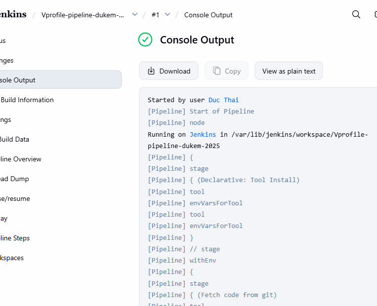
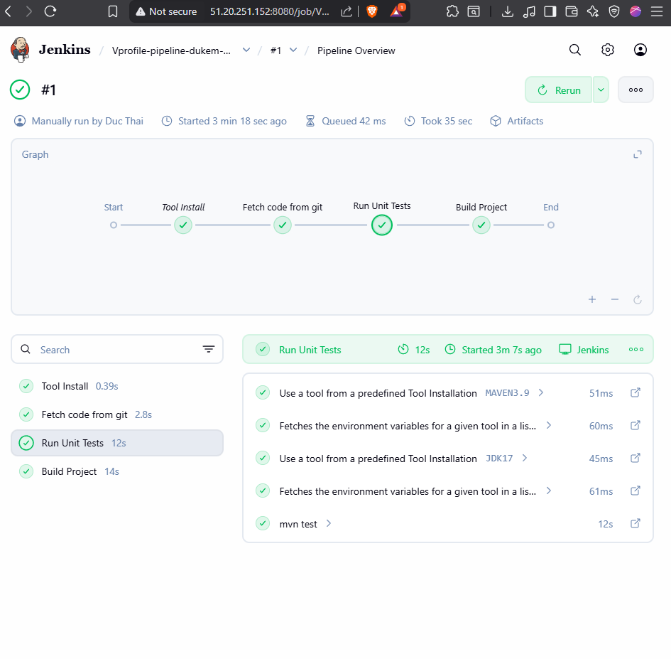

## what is paac with jenkins?
what really is Pipeline as a code?

It's Jenkins way of setting up Pipeline automatically

by using a file called as Jenkinsfile.

J capital there.

So we can put this file in our source code

or we can write it in the Jenkins job itself.

Jenkinsfile really defines the stages in the CI/CD Pipeline.

As we create jobs,

there'll be different stages in the Jenkinsfile define.

Jenkinsfile is a text file

and it has its own domain specific language,

but it's very close to groovy,

but you really don't need to know groovy

to write a Jenkinsfile.

There are two syntax, one is scripted

and the other one is declarative.

Declarative is the way forward now

and we are going to use declarative in this project.

Okay, some concepts in the Pipeline.

First of all, you have Pipeline

that's gonna be in the main block

and everything inside Pipeline will be executed by Jenkins.

Nodes or agent, they're both settings.

You can define where this Pipeline can get executed,

on which node or on which agent.

There are stages where the actual execution happen.

emxmaple 
```
pipeline {
 agent {

 }
 tools {
   maven 'Maven 3.9.9'
 }
 environment {
   JAVA_HOME = '/usr/lib/jvm/java-17-openjdk-amd64'
 }

 stages {
        steps {
            // steps go here
        
        }

        post {
           // post actions go here
           success {
               echo 'This will run only if successful'
           }
              failure {
                echo 'This will run only if failed'
              }
        }
 }

}

```

agent is where the Pipeline will run. It can be any node in Jenkins.
tools is where you define the tools you need for this Pipeline, like Maven, JDK, NodeJS, etc.
environment is where you define environment variables, like JAVA_HOME.
stages is where you define the actual stages of your Pipeline, like Build, Test, Deploy, etc.

## klet try to write the demo Jenkinsfile 

```groovy
pipeline {
    // where do we run the pipeline/which agent
    agent any
    tools {
        // which version of maven we use
        maven 'MAVEN3.9'
        // which version of jdk we use
        jdk 'JDK17'
    }

    stages {
        stage("Fetch code from git") {
            steps {
                // mention the pulgin we want to use and params
                git branch: 'atom', url : 'https://github.com/vvduth/vprofile-project.git'
            }
        }
        // run unit tsest using maven
        stage("Run Unit Tests") {
            steps {
                // run maven command to run unit tests
                sh 'mvn test'
            }
        }

        // install dependencies and build the project
        stage("Build Project") {
            steps {
                // run maven command to build the project
                sh 'mvn clean install -DskipTests=true'
            }
            post {
                // if build is successful
                success {
                    echo 'Build completed successfully!'
                    // use archiveArtifacts to store the built war file as a build artifact
                    archiveArtifacts artifacts: 'target/*.war'
                }
                // if build fails
                failure {
                    echo 'Build failed. Please check the logs for details.'
                }
            }
        }
    }
}
```

go to jenkins => creae new item => pipeline => paste the above code in the pipeline script section => save => build now



