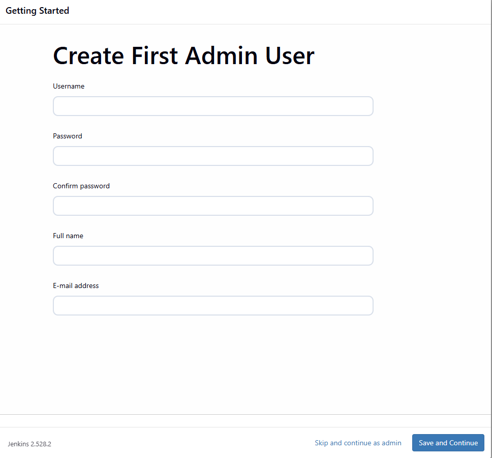
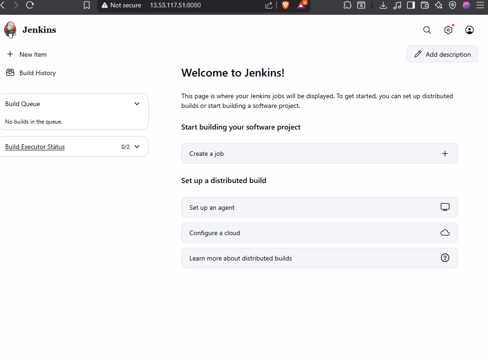

## What is Continuous Integration (CI)?

Continuous Integration (CI) is a development practice where developers frequently merge their code changes into a central repository. Each integration is automatically built and tested, allowing teams to detect problems early.

**Typical CI workflow:**
1. Developers code, build, and test locally
2. If everything works, they push changes to a centralized version control system
3. This process repeats continuously for all team members

---

## The Problem with Manual Integration

When multiple developers merge code into a central repository many times a day, issues can accumulate:
- Code is merged but not truly integrated
- Bugs, conflicts, and errors are only discovered much later, often after days or weeks
- Fixing these issues requires significant rework, especially as deadlines approach
- Integration becomes a painful, time-consuming process

---

## How Continuous Integration Solves This

Continuous Integration automates the process:
- Every code change triggers an automated build and test
- If something breaks, the developer is notified immediately
- Developers stop and fix issues as soon as they are detected
- Problems are caught and resolved early, preventing accumulation

**Benefits:**
- Immediate feedback on code quality
- Fewer integration headaches
- Higher code quality and faster delivery

---

## What is Jenkins?

Jenkins is the most popular open-source tool for implementing Continuous Integration. It started as a CI tool but has grown into a powerful automation server for many DevOps tasks.

**Basic Jenkins CI process:**
- Developer pushes code to repository
- Jenkins fetches the code, builds it, runs tests, and notifies the developer of results

---

## Jenkins Features and Extensibility

Jenkins is:
- **Open source:** Free to use and supported by a large community
- **Extensible:** Thousands of plugins are available for version control, build tools (Java, .NET, Node.js, etc.), cloud providers, testing, and more

Developers worldwide contribute to Jenkins, making it better every day. Its plugin ecosystem allows Jenkins to support almost any workflow or toolchain.

---

## Jenkins Use Cases

You can use Jenkins for:
- Continuous Integration (CI)
- Continuous Delivery (CD)
- Running scripts and automation tasks
- Running software test cases
- Cloud automation
- Integrating with other DevOps, developer, or tester tools

Jenkins is highly flexible and can be adapted to many different automation needs.

---

## Jenkins Installation

Jenkins installation is straightforward:
- Requires Java JRE or JDK (JDK is recommended)
- Runs on any major operating system (Windows, Linux, macOS)

Once installed, Jenkins can be accessed via a web interface and configured to fit your team's workflow.

---
## set up an ec2 instance for jenkins
- launch an ec2 instance (amazon linux 2 or ubuntu): I se ubuntu cuz in easy to install jenkins
- allow port 8080 in security group
- use large instance t3.smaller which has 2 gb ra, so we can build and test projects
* jenkins runs on port 8080, same with tomcat server


- ssh in to ur ec2
- update ur instance
```bash
sudo apt update && sudo apt upgrade -y
```

- install jdk 
```bash
sudo apt install openjdk-21-jdk -y
```

- isntall jenkins
```bash
sudo wget -O /etc/apt/keyrings/jenkins-keyring.asc \
  https://pkg.jenkins.io/debian-stable/jenkins.io-2023.key
echo "deb [signed-by=/etc/apt/keyrings/jenkins-keyring.asc]" \
  https://pkg.jenkins.io/debian-stable binary/ | sudo tee \
  /etc/apt/sources.list.d/jenkins.list > /dev/null
sudo apt update
sudo apt install jenkins -y
```

verify jenkins is running
```bash
sudo systemctl status jenkins
root@ip-172-31-29-194:~# systemctl status jenkins
● jenkins.service - Jenkins Continuous Integration Server
     Loaded: loaded (/usr/lib/systemd/system/jenkins.service; enabled; preset: enabled)
     Active: active (running) since Sun 2025-11-30 12:06:57 UTC; 36s ago
   Main PID: 4167 (java)
      Tasks: 50 (limit: 2204)
     Memory: 482.4M (peak: 508.8M)
        CPU: 20.379s
     CGroup: /system.slice/jenkins.service


```
==> green as a tick = we cool

-check jenkins home dir
```bash
root@ip-172-31-29-194:~# ls /var/lib/jenkins/
config.xml                     jenkins.telemetry.Correlator.xml  nodeMonitors.xml  secret.key                secrets  userContent
hudson.model.UpdateCenter.xml  jobs                              plugins           secret.key.not-so-secret  updates  users

```

if u want to take back of jenkin, just shut down service, archive jenkins home dir /var/lib/jenkins, overrite it when u want to restore it

### broswer
* goto http://your-ec2-public-ip:8080
you should see this unlock jenkins page


- get the password
```bash
sudo cat /var/lib/jenkins/secrets/initialAdminPassword
```
### install suggested plugins
 * we can say plugins are the Jenkins powerhouse.
So if there is a question, what Jenkins can do,
it depends on what plugins are available.
Jenkins can run build CI/CD stuff, of course,
but there's so many other build tools, right?
Like we are using Maven,
you might need to use, you know,
something else, Ant, Gradle, some Node.js build.js build.
    
### create first admin user



### welcome to jenkins


and we say "Thank you, Koshuke" (founder of jenkins)

## freestyle vs paac 
* freestyle is the classic jenkins job type
* So freestyle job are all graphical jobs.
So you click on create a job and you fill all the information.
It's basically a form filling.
You run the job and you see it's output.
Now that's fine and good, but the problem with this is, you will have many types, many jobs, many jobs that you need to connect together to create a pipeline.

Fetch the code.

Build the code on another job, then run

test another job, to deploy another job, and then you connect all of them together manually, one

by one.

Now, it's not a problem, but it's a problem when you want to replicate the same thing if you want to do the same thing in other project.
A similar thing in another Jenkins.

* in real time, we need everythignas as a code in deveops world.
* so we need jenkins pipeline as code
* So you create a similar pipeline or same pipeline, which will be written in Groovy Language.

So it's similar to creating a job.

You create a job.

But in that job you mention this entire script and that entire script is your pipeline.

That's all.

And you can version control it because it will be all text.

And it is recommended now because we need everything as a code, so pipeline also as a code.